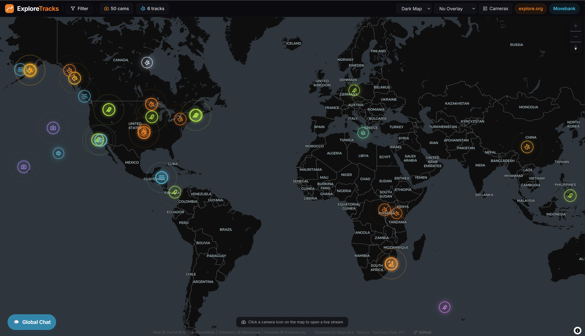
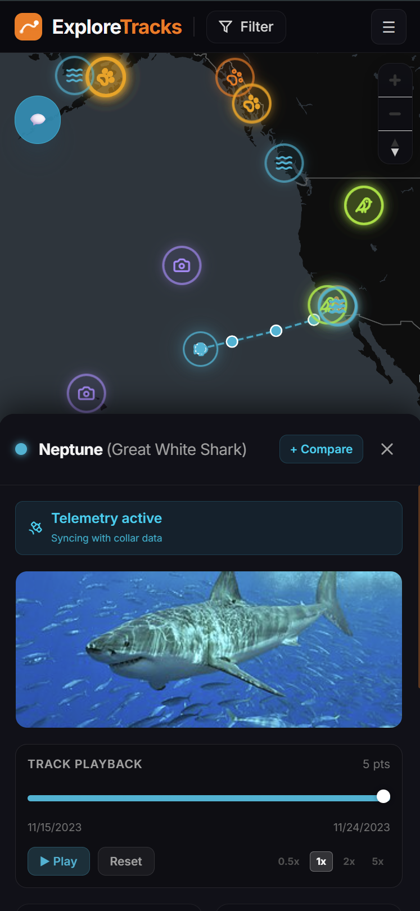
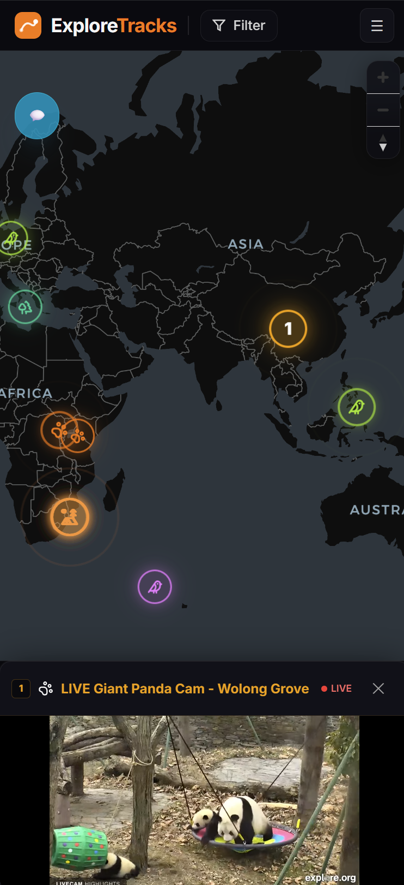

# ExploreTracks

ExploreTracks is a fully responsive interactive global map platform for wildlife enthusiasts. It combines live nature cameras from [explore.org](https://explore.org) with real-time animal tracking telemetry from [Movebank](https://www.movebank.org), letting you observe wildlife in real-time across the globe on any device.

Live Demo: [explore-tracks.vercel.app](https://explore-tracks.vercel.app)

<p align="center">
  
</p>
<p align="center">
  
  &nbsp;&nbsp;&nbsp;&nbsp;
  
</p>

---

## Features

- **Interactive Global Map** — Multiple base-map styles (Dark, Voyager, Light, Satellite), powered by MapLibre GL JS and CartoDB.
- **Live Wildlife Cameras** — Up to 50 concurrent live streams from explore.org, automatically geo-located via a title-keyword dictionary.
  - Desktop: draggable, resizable floating video windows (up to 12 open simultaneously).
  - Mobile: full-width bottom tray with tab switching between open cameras.
- **Real-Time Animal Tracks** — GPS movement tracks from Movebank (bears, eagles, sea turtles, elephants, sharks). Data is fetched completely offline using a Node script, serving zero-latency static data in production to avoid API rate limits.
- **Danmaku Overlay** — YouTube Live Chat messages float across the video as danmaku (toggleable, default off).
- **Global Chat Room** — Desktop: draggable resizable floating window. Mobile: slide-up bottom sheet.
- **Filter and Search** — Filter by camera category or animal type; free-text search by name or location.
- **Fully Responsive (RWD)** — Optimised for phones, tablets, and desktops with a hamburger navigation on mobile.

---

## Tech Stack

| Layer | Technology |
|---|---|
| Framework | Next.js 16 (App Router, React Server Components) |
| Styling | Tailwind CSS |
| Map Engine | MapLibre GL JS |
| Base Maps | CartoDB (free, no API key required) |
| Live Cameras | YouTube Data API v3 |
| Animal Telemetry | Movebank REST API |
| Floating UI | react-rnd |
| Data Fetching | SWR |
| Deployment | Vercel |

---

## Getting Started

### 1. Clone the repository

```bash
git clone https://github.com/Onyzelabs/ExploreTracks.git
cd ExploreTracks
```

### 2. Install dependencies

```bash
npm install
```

### 3. Set up environment variables

Create a `.env.local` file in the root directory:

```env
# YouTube Data API v3 key (for fetching live cameras and danmaku chat)
YOUTUBE_API_KEY=your_youtube_api_key

# Movebank credentials (for fetching animal telemetry tracks)
MOVEBANK_USERNAME=your_movebank_username
MOVEBANK_PASSWORD=your_movebank_password
MOVEBANK_STUDY_IDS=2911040,21231406,9651291
```

> **Note**: Both services have graceful fallbacks.
> Without `YOUTUBE_API_KEY` or when the daily quota (100 Search queries) is exhausted, the app falls back to `src/data/seed-cameras.json` — a snapshot of the last successful 50-camera fetch.
> Movebank tracks are always served directly from `src/data/seed-tracks.json`. You only need Movebank credentials when you manually run the script to refresh the data.

### 4. Run the development server

```bash
npm run dev
```

Open [http://localhost:3000](http://localhost:3000) in your browser.

---

## Deployment (Vercel)

1. Import your GitHub repository to Vercel.
2. In **Project Settings > Environment Variables**, add all keys from your `.env.local`.
3. Click **Deploy**.

Next.js API routes proxy all credentials server-side, so API keys are never exposed to the browser.

---

## Maintenance Scripts

### Refresh the camera seed snapshot

When the YouTube API quota resets (midnight PT) and cameras are loading correctly, run the following to update the fallback snapshot committed to the repository:

```bash
node scripts/refresh-seed-cameras.js
git add src/data/seed-cameras.json
git commit -m "chore: refresh seed cameras snapshot"
git push
```

### Refresh animal tracking data

Animal tracking data is fetched using an offline script to avoid Movebank API rate limiting and timeouts on user request. When you want to pull new telemetry data, run the following:

```bash
npm run update-tracks
git add src/data/seed-tracks.json
git commit -m "chore: update animal tracks data"
git push
```

---

## API Quota Notes

| Endpoint | Daily Limit | Usage per request |
|---|---|---|
| YouTube Search | 100 queries | 1 query per cache miss (TTL: 60 min) |
| YouTube Videos | 10,000 queries | 1 query per open video (danmaku) |
| Movebank | Rate-limited | 0 at runtime (updated offline via script) |

---

## License

Open-source. Map data copyright OpenStreetMap contributors and CartoDB. Animal telemetry copyright Movebank. Live streams copyright explore.org.
